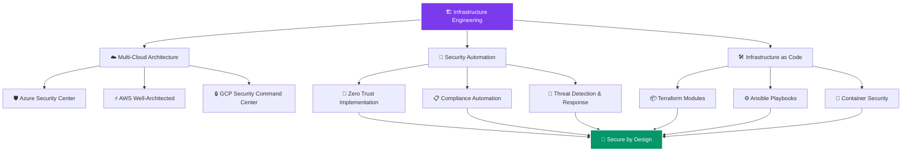

<!-- Profile Views -->
<div align="center">
  
</div>

<!-- Dynamic Banner -->
<div align="center">
  <svg width="600" height="120" xmlns="http://www.w3.org/2000/svg">
    <defs>
      <linearGradient id="grad" x1="0%" y1="0%" x2="100%" y2="0%">
        <stop offset="0%" style="stop-color:#4c1d95"/>
        <stop offset="50%" style="stop-color:#7c3aed"/>
        <stop offset="100%" style="stop-color:#a855f7"/>
      </linearGradient>
    </defs>
    <rect width="600" height="120" rx="15" fill="url(#grad)"/>
    <text x="300" y="75" font-family="Arial" font-size="48" font-weight="bold" 
          text-anchor="middle" fill="white" letter-spacing="0.3em">ZIRK</text>
  </svg>
</div>

<!-- Elevator Pitch with Animation -->
<div align="center">
  


*Transforming complex infrastructure challenges into automated, secure, and scalable solutions*

</div>

---

## 👨‍💻 **Who I Am**


- 🏗️ **Cloud Infrastructure Engineer** – Designing and securing enterprise-grade multi-cloud environments
- 🔐 **Security-First Advocate** – Implementing Zero Trust, compliance automation, and security by design  
- ⚡ **Automation Enthusiast** – From IaC (Terraform, Ansible) to DevOps pipelines for faster, safer delivery
- 🎮 **Community**: Join our growing [Discord Community](https://discord.gg/f5V6Usf)
- 💼 **Philosophy**: *"Automate everything, secure by design, fail fast and recover faster"*

<br clear="both"/>

---

## ✨ **Career Highlights**

<div align="center">

```diff
+ Led Azure tenant consolidation project (SSO + MFA) for 10k+ users
+ Migrated 40+ DevOps projects with Terraform & Ansible automation
+ Implemented ISO 27001 security controls across multi-cloud infrastructure  
+ Certified in Terraform, Docker, Azure, Security+ and growing portfolio
```

</div>

---

## ⚡ **Tech Stack**

<div align="center">

| **Infrastructure & IaC** | **Cloud Platforms** | **Security & Compliance** | **DevOps & Monitoring** |
|:------------------------:|:--------------------:|:--------------------------:|:------------------------:|
|   |   |   |   |
|   |   |   |   |
|   |   |   |   |

</div>

---

## 📊 **GitHub Analytics** 

<div align="center">

| **📈 Performance Metrics** | **💻 Tech Distribution** | **🔥 Contribution Activity** |
|:--------------------------:|:------------------------:|:----------------------------:|
| [](https://github.com/anuraghazra/github-readme-stats) | [](https://github.com/anuraghazra/github-readme-stats) | [](https://git.io/streak-stats) |
| **Real-time GitHub performance** | **Language expertise distribution** | **Consistent development activity** |
| [](https://github.com/vn7n24fzkq/github-profile-summary-cards) | [](https://github.com/ryo-ma/github-profile-trophy) | [](https://github.com/ashutosh00710/github-readme-activity-graph) |
| **Development time patterns** | **Achievement milestones earned** | **Year-round contribution trends** |

</div>

---

## 🏆 **Professional Certifications**

<div align="center">

| **🛡️ Security & Compliance** | **☁️ Cloud Platforms** | **🏗️ Infrastructure & Automation** | **🤖 AI & Emerging Tech** |
|:-----------------------------:|:----------------------:|:----------------------------------:|:--------------------------:|
|  |  |  |  |
| **Enterprise security framework implementation** | **Microsoft cloud platform fundamentals** | **Infrastructure as Code expertise** | **Artificial Intelligence foundations** |
|  |  |  |  |
| **Network security and routing protocols** | **Amazon Web Services core concepts** | **Configuration management and automation** | **Azure cognitive services and ML basics** |
|  |  |  | |
| **Cybersecurity principles and risk management** | **Oracle Cloud Infrastructure essentials** | **Containerization and orchestration** | |

</div>

---

## 🎯 **Current Focus & Architecture**

<div align="center">



</div>

---

## 💬 **Let's Connect & Collaborate**

<div align="center">

| **🤝 Professional Networking** | **🎮 Community & Social** | **📧 Direct Communication** |
|:------------------------------:|:--------------------------:|:----------------------------:|
| [](https://linkedin.com/in/your-profile) | [](https://discord.gg/f5V6Usf) | [](mailto:your-email@example.com) |
| **Connect for career opportunities** | **Join our tech community discussions** | **Direct contact for collaborations** |
| [](https://twitter.com/your-handle) | [](https://github.com/rortiz-09) | [](https://t.me/your-handle) |
| **Follow for tech insights and updates** | **Explore repositories and contributions** | **Quick messaging for urgent matters** |

### 🚀 **I'm open to opportunities in Cloud, Security & DevOps**
*Let's discuss how I can bring value to your infrastructure and security initiatives*

</div>

---

## ☕ **Support My Open Source Journey**

<div align="center">

**If you find my projects helpful, consider supporting my journey!**  
*Every contribution fuels more open-source magic* ✨

[](https://ko-fi.com/I2I511MRJ1)
[](https://www.buymeacoffee.com/rortiz09)

### 🪙 **Crypto Donations Welcome!**
```
🔸 Bitcoin (BTC): 1N3MeV2dsX6gQB42HXU6MF2hAix1mqjo8i
🔸 Ethereum (ETH): Your_ETH_Address_Here
🔸 Other cryptos accepted!
```

</div>

---

<div align="center">


<br/>

**🎯 Ready to transform your infrastructure? Let's connect!**

</div>

---

<div align="center">
  
</div>


</div>

<div align="center">
  
</div>
