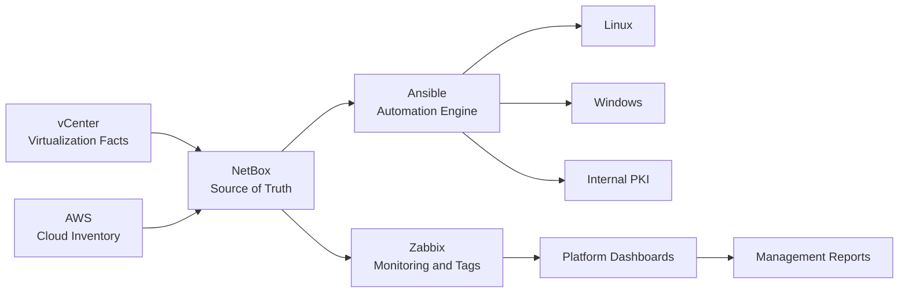

<div align="center">


[](https://github.com/rortiz-09)
[](https://www.linkedin.com/in/ronnyortiz/)
[](mailto:ronny.ortiz.54@hotmail.com)


</div>

---

## Platform Focus

I lead and build platform operations across hybrid infrastructure: on-premises systems, virtualization, monitoring, automation and cloud governance. My work is centered on making infrastructure easier to understand, safer to operate and faster to improve.

```text
Source of truth        NetBox
Operational health     Zabbix
Automation engine      Ansible
Provisioning model     Terraform
Cloud governance       AWS / Azure
Security foundation    PKI, access control, baseline validation
```

## What I Am Building Now

<table>
  <tr>
    <td width="50%">
      <h3>Infrastructure Automation</h3>
      <p>Designing Ansible workflows that read from NetBox, validate real connectivity, configure Linux and Windows, and report operational gaps before changes are applied.</p>
    </td>
    <td width="50%">
      <h3>Observability and Leadership Dashboards</h3>
      <p>Building Zabbix views for platform leadership, service health, incident awareness, capacity, ownership and executive reporting.</p>
    </td>
  </tr>
  <tr>
    <td width="50%">
      <h3>Cloud Governance</h3>
      <p>Reviewing AWS accounts, budgets, security exposure, VPN health, cost optimization and inventory synchronization into NetBox.</p>
    </td>
    <td width="50%">
      <h3>Internal Trust</h3>
      <p>Implementing internal PKI, trusted certificates, DNS alignment and certificate lifecycle procedures for internal services.</p>
    </td>
  </tr>
</table>

## Featured Repositories

| Repository | What It Represents |
|---|---|
| [ansible-infra](https://github.com/rortiz-09/ansible-infra) | Current automation baseline for NetBox, Zabbix, Linux, Windows, VMware, AWS and operational reporting. |
| [Terraform-Infra](https://github.com/rortiz-09/Terraform-Infra) | Infrastructure as Code patterns for repeatable cloud/platform provisioning. |
| [TerraformPipelines](https://github.com/rortiz-09/TerraformPipelines) | Pipeline-oriented Terraform experiments and automation flow. |
| [web-page-astro](https://github.com/rortiz-09/web-page-astro) | Personal web project using Astro. |

## Stack

<div align="center">


</div>

## Operating Principles

```diff
+ Inventory must be trustworthy before automation scales.
+ Monitoring must tell operators what changed, what matters and who owns it.
+ Infrastructure changes should be versioned, reviewed and reversible.
+ Reports should serve both engineers and management.
+ Documentation is part of the platform, not an afterthought.
```

## Current Architecture Direction



## GitHub Signals

<div align="center">


</div>

## Contact

<div align="center">

[](https://www.linkedin.com/in/ronnyortiz/)
[](mailto:ronny.ortiz.54@hotmail.com)
[](https://github.com/rortiz-09)

</div>


